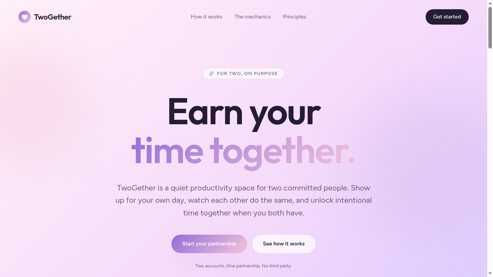
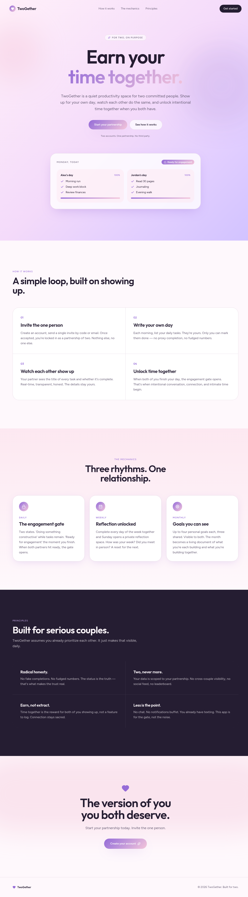
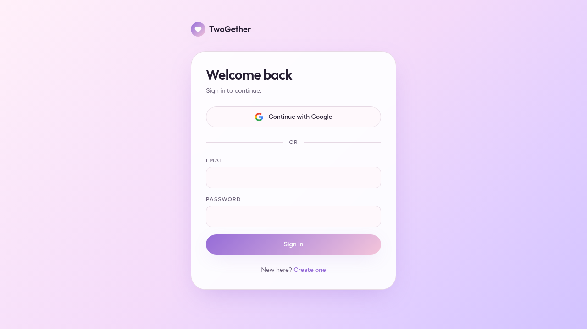

<p align="center">
  
</p>

<h1 align="center">TwoGether</h1>

<p align="center">
  <strong>Earn your time together.</strong><br/>
  A quiet productivity space for two committed people.
</p>

---

##  Project Overview

**TwoGether** is a two-person productivity platform for serious couples. Each partner privately commits to their own day. When both finish what they said they would, the day's **engagement gate** opens — unlocking intentional time together.

The product is built around three rhythms:

| Rhythm | What it is |
|---|---|
| **Daily** — The engagement gate | Two states: *Doing something constructive* or *Ready for engagement*. The gate opens the moment both partners finish. |
| **Weekly** — Reflection unlocked | Completing every day of the week opens a private Sunday reflection space. |
| **Monthly** — Goals you can see | Up to four personal goals each, shared and visible to both partners. |

No chat. No notification buffet. No social feed. The gate, not the noise.

---

##  Tech Stack

- **Framework:** [TanStack Start](https://tanstack.com/start) v1 (React 19, Vite 7, SSR)
- **Styling:** Tailwind CSS v4 (design tokens in `src/styles.css`, `oklch` palette)
- **UI primitives:** shadcn/ui + Radix
- **Backend:** Lovable Cloud (managed Supabase — Postgres, Auth, Realtime, RLS)
- **Server logic:** TanStack `createServerFn` (no Edge Functions)
- **Deploy target:** Cloudflare Workers (via `@cloudflare/vite-plugin`)
- **Type system:** TypeScript (strict), ESLint, Prettier
- **Package manager:** [Bun](https://bun.sh)

---

##  Screenshots

### Landing page

The landing page introduces the core promise — *earn your time together* — and previews the daily engagement gate.



### The full marketing flow

Three sections explain how it works, the three rhythms, and the principles the product is built on.



### Sign in / Sign up

Email + password and **Continue with Google** sign-in. New partners create an account here, then enter or generate a single invite code to lock into a partnership of two.



> **Note:** The in-app screens (`/app`, `/goals`, `/reflections`, `/dates`) live behind authentication. Sign in or create an account to access them.

---

##  Prerequisites

Before you begin, install:

| Tool | Minimum version | Why |
|---|---|---|
| **[Node.js](https://nodejs.org/)** | `20.x` or newer | Runtime for tooling |
| **[Bun](https://bun.sh)** | `1.1+` | Package manager + script runner (preferred). npm/pnpm also work. |
| **Git** | any recent | Clone & sync with GitHub |
| A modern browser | Chrome / Safari / Firefox latest | App requires ES2022 + modern CSS |

**System requirements:** macOS, Linux, or Windows (WSL2 recommended on Windows). ~500 MB free disk for `node_modules` + build cache.

You will also need access to a **Lovable Cloud** project (provisioned automatically inside Lovable) or your own Supabase project if running outside Lovable.

---

##  Installation

### 1. Clone the repository

```bash
git clone https://github.com/<your-username>/twogether.git
cd twogether
```

### 2. Install dependencies

```bash
bun install
```

> Using npm? Run `npm install`. Using pnpm? Run `pnpm install`.

This pulls in React 19, TanStack Start/Router/Query, Tailwind v4, Radix UI, the Supabase JS client, and the Cloudflare Vite plugin.

### 3. Configure environment variables

The project reads connection info from a `.env` file at the repo root. When working inside Lovable this file is **auto-generated and managed for you** — do not edit it. When running locally, create it manually:

```bash
# .env
VITE_SUPABASE_URL=https://<your-project-ref>.supabase.co
VITE_SUPABASE_PUBLISHABLE_KEY=<your-anon-publishable-key>
VITE_SUPABASE_PROJECT_ID=<your-project-ref>
```

Get these values from your Lovable Cloud / Supabase project settings.

### 4. Apply database migrations

Database schema is tracked in `supabase/migrations/`. If you are using your own Supabase project, push the migrations once:

```bash
bunx supabase db push
```

When the project runs on Lovable Cloud, migrations are applied automatically through the platform — no manual step needed.

### 5. Start the dev server

```bash
bun run dev
```

Open **http://localhost:5173** in your browser.

### 6. Verify the installation

You should see:

1. The TwoGether **landing page** at `/` with the *"Earn your time together."* hero.
2. The **sign-in page** at `/auth` with email + Google options.
3. After signing up, redirect to `/app` (the daily Today view).

If all three load without errors in the browser console, you're good.

---

##  Available Scripts

| Command | What it does |
|---|---|
| `bun run dev` | Start the Vite dev server with HMR on port 5173 |
| `bun run build` | Production build (Cloudflare Workers target) |
| `bun run build:dev` | Build in development mode (used for preview deploys) |
| `bun run preview` | Preview the production build locally |
| `bun run lint` | Run ESLint over the codebase |
| `bun run format` | Format with Prettier |

---

##  Project Structure

```
.
├── public/
│   └── favicon.png              # The TwoGether mark
├── src/
│   ├── routes/                  # File-based routing (TanStack)
│   │   ├── __root.tsx           # Root layout (head, meta, providers)
│   │   ├── index.tsx            # Landing page
│   │   ├── auth.tsx             # Sign in / sign up
│   │   ├── app.tsx              # Today / engagement gate
│   │   ├── goals.tsx            # Monthly couple + personal goals
│   │   ├── reflections.tsx      # Weekly reflection space
│   │   └── dates.tsx            # Important dates
│   ├── components/              # Reusable UI (streak-bar, celebration-inbox, ui/*)
│   ├── hooks/                   # use-auth, use-mobile, ...
│   ├── integrations/supabase/   # Auto-generated client + types (do not edit)
│   ├── lib/                     # Server functions (*.functions.ts) + utils
│   └── styles.css               # Tailwind v4 + design tokens (Blush & Lavender)
├── supabase/
│   ├── config.toml              # Project settings (auto-managed)
│   └── migrations/              # SQL migrations
├── vite.config.ts
└── package.json
```

---

##  Features

- 🔐 **Email + Google authentication** with RLS-scoped partnerships
- 💞 **Invite-code partnerships** — exactly two people, no more
- ✅ **Daily tasks** with the *Ready for engagement* gate
- 🔥 **Streak tracking** — daily, monthly couple, and personal streaks
- 📝 **Weekly reflections** unlocked by completing all 7 days
- 🎯 **Monthly goals** — up to 4 personal goals each, both visible
- 📅 **Important dates** with countdowns (anniversaries, birthdays, …)
- 🎉 **Celebration inbox** for partner milestones
- 🌓 **Light + dark mode** via the *Blush & Lavender* design system

---

##  Usage Walkthrough

1. **Sign up** at `/auth`. Choose email + password or *Continue with Google*.
2. **Create or accept an invite code** to lock in as a partnership of two.
3. **Each morning**, write your own daily tasks in `/app`.
4. **Tick tasks off** as you go. Your partner sees the title and completion state in real-time.
5. **When both of you hit 100%**, the engagement gate flips to *Ready for engagement* — that's your unlocked time together.
6. **At month boundaries**, set up to 4 personal goals in `/goals`.
7. **On Sundays** (after a full week of completed days), the `/reflections` space opens.

---

##  Troubleshooting

| Problem | Fix |
|---|---|
| `Failed to resolve import` on first run | Re-run `bun install`. Ensure Node ≥ 20. |
| Sign-in succeeds but `/app` stays on a spinner | Check `.env` has the correct `VITE_SUPABASE_URL` and `VITE_SUPABASE_PUBLISHABLE_KEY`. |
| `Unsupported provider: provider is not enabled` on Google sign-in | Enable Google in your Cloud → Users → Auth settings → Sign in methods. |
| 401 / `Unauthorized` from a server function | The function is wrapped in `requireSupabaseAuth`. Make sure `attachSupabaseAuth` is registered in `src/start.ts` and you are signed in. |
| Empty page after a route change | A parent layout is missing `<Outlet />`. Check `src/routes/__root.tsx` and any `_layout.tsx`. |
| iOS Safari zooms on input focus | Inputs need `font-size ≥ 16px` on mobile — see the responsive notes in `src/styles.css`. |
| `process.env.X is undefined` in the browser | `process.env` is server-only. Use `import.meta.env.VITE_*` in client code. |

---

##  Deployment

The project builds for **Cloudflare Workers** out of the box (see `wrangler.jsonc`). When developing in Lovable, hitting **Publish** ships the latest preview to your published URL — no manual deploy needed. The repository auto-syncs with GitHub if the GitHub integration is connected.

---

##  License

Private project. All rights reserved © 2026 TwoGether.

---

<p align="center">
  <br/>
  <em>Built for two.</em>
</p>
